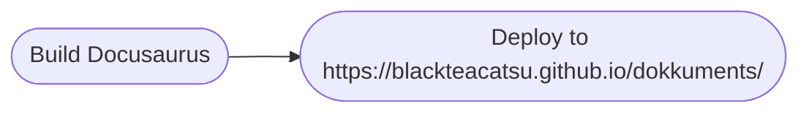

<video width="320" height="240" controls>
  <source src="https://github.com/blackteacatsu/spring_2024_envs_research_amazon_ldas/blob/main/media_files/Map_3D.mp4" type="video/mp4">
</video>

# Website

This website is built using [Docusaurus](https://docusaurus.io/), a modern static website generator.

### Installation

```
$ yarn
```

### Local Development

```
$ yarn start
```

This command starts a local development server and opens up a browser window. Most changes are reflected live without having to restart the server.

### Build

```
$ yarn build
```

This command generates static content into the `build` directory and can be served using any static contents hosting service.

### Deployment

Using SSH:

```
$ USE_SSH=true yarn deploy
```

Not using SSH:

```
$ GIT_USER=<Your GitHub username> yarn deploy
```

If you are using GitHub pages for hosting, this command is a convenient way to build the website and push to the `gh-pages` branch.

### Triggering deployment using GitHub Actions

This website uses GtiHub Action for auto deployment, the GitHub pipeline files are stored under `.github/workflows/deploy.yml`. The source repo and deployment repo are the same repository. Therefore, committing and pushing from a remote repo to the `main` branch of this GitHub repo will automatically trigger this GitHub Pipeline.

