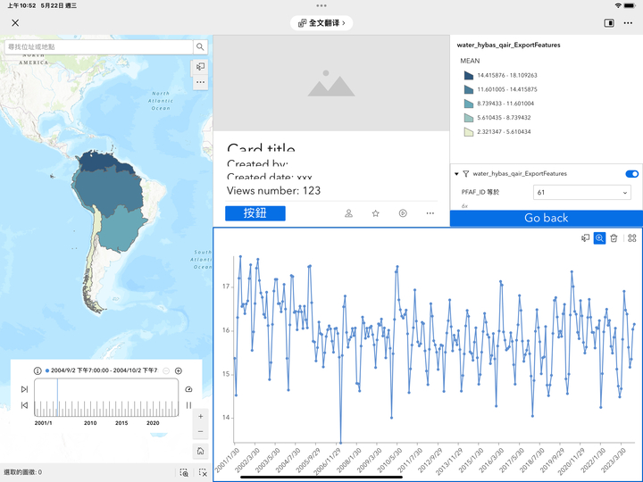
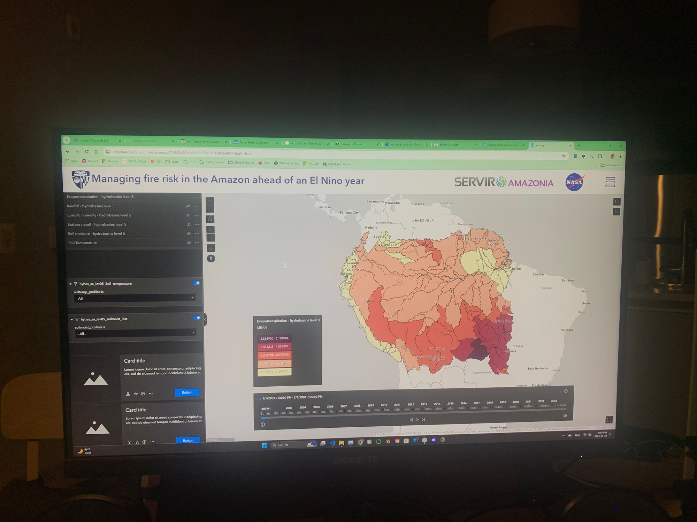

# Evolution & Development of Amazon Hydro-viewer

This

## May 22nd, 2024 Version 0.0
The first demo we did through arcgis experience builder, the data are processed with Hydrobasins at level 2.

## May 30th, 2024
UI got it redesign for the first time

## July 2nd, 2024
The interface underwent another redesign, and is currently maintained as below
