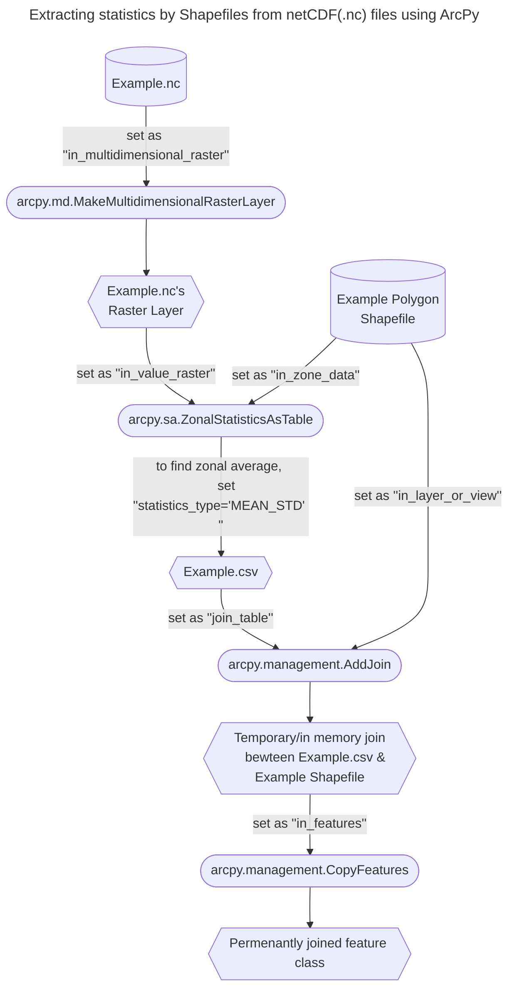

# Raster to polygon conversion

## Introduction
This documentation page go through the raster to polygon conversion we used when we put together


## General Workflow


## Scripting

### Setup
:::warning
The method described in this page requires the installation of Esri's ArcGIS Pro and ArcPy library. Select Python kernel to     
:::

### Import


```python title
output_layer_name = f"LIS_HIST_2001_to_2023_Monthly_{var}" 

# Import NetCDF as raster layer
arcpy.md.MakeMultidimensionalRasterLayer(
in_multidimensional_raster=nc_path,
out_multidimensional_raster_layer= output_layer_name,
variables=vars,
dimension_def="ALL",
dimension_ranges=None,
dimension_values=None,
dimension="",
start_of_first_iteration="",
end_of_first_iteration="",
iteration_step=None,
iteration_unit="",
template='-82 -20.9999999999981 -49.0000000000019 6.00000000000038 GEOGCS["GCS_WGS_1984",DATUM["D_WGS_1984",SPHEROID["WGS_1984",6378137.0,298.257223563]],PRIMEM["Greenwich",0.0],UNIT["Degree",0.0174532925199433]]',
dimensionless="DIMENSIONS",
spatial_reference=None
)

# Check if the import process is complete
print(f"Created and saved multidimensional raster layer for variable: {vars}") 
```

Calculate zonal statistic as table by polygon 
```python
arcpy.sa.ZonalStatisticsAsTable(
    in_zone_data="~\amazon_ldas_netcdf_to_vector.gdb\hybas_sa_lev05_areaofstudy",
    zone_field="PFAF_ID",
    in_value_raster= output_layer_name,
    out_table=f"~\amazon_ldas_netcdf_to_vector.gdb\ZonalSt_hybas_lev05_{vars}",
    ignore_nodata="DATA",
    # Check Esri Documentation for all stats methods supported
    statistics_type="MEAN_STD", 
    process_as_multidimensional="ALL_SLICES",
    percentile_values=90,
    percentile_interpolation_type="AUTO_DETECT",
    circular_calculation="ARITHMETIC",
    circular_wrap_value=360,
    out_join_layer="",)
```
For example, `statistics_type="MEAN_STD"` will find the variable's average and standard deviation across the polygon.


### Appending csv files to an exisiting polygon feature class

**Step 0**: Validate Join

```python
arcpy.management.ValidateJoin(
    in_layer_or_view="hybas_sa_lev05_areaofstudy",
    in_field="PFAF_ID",
    join_table="ZonalSt_hybas_lev05_Qs_tavg_anomaly",
    join_field="PFAF_ID",
)
```
Terminal output should show the following:

```shell
Messages
Start Time: July 4, 2024 7:34:30 PM
Checking for invalid characters...
Checking workspaces...
Checking for field indexes...
The join field PFAF_ID in the table amazon_ldas_netcdf_to_vector.ZonalSt_hybas_lev05_Qs_tavg_anomaly is not indexed. To improve performance, we recommend that an index be created.
Checking for OIDs...
Checking for join cardinality (1:1 or 1:m joins)...
A one - to - many join has created 4XXXX records from 150 matches.
The input table has 151 and the join table has 41400 records.
Succeeded at July 4, 2024 7:34:31 PM (Elapsed Time: 0.84 seconds)
```

We know that performing a join operation through this way is successful since, it suggested that resulting attribute table will have 4xxxx data entries.

***Step 1***

```python

arcpy.management.AddJoin(
    in_layer_or_view="hybas_sa_lev05_areaofstudy",
    in_field="PFAF_ID",
    join_table=table,
    join_field="PFAF_ID",
    join_type="KEEP_ALL",
    index_join_fields="NO_INDEX_JOIN_FIELDS",
    rebuild_index="NO_REBUILD_INDEX",
    join_operation="JOIN_ONE_TO_MANY"
) 
    
arcpy.management.CopyFeatures(
    in_features="hybas_sa_lev05_areaofstudy",
    out_feature_class=rf"\amazon_ldas_netcdf_to_vector.gdb\hybas_sa_lev05_anomaly_of_{vars}",
    config_keyword="",
    spatial_grid_1=None,
    spatial_grid_2=None,
    spatial_grid_3=None
)
    
arcpy.management.RemoveJoin(
    in_layer_or_view="hybas_sa_lev05_areaofstudy",
    join_name=""
)
```

:::info Note on `join_operation`
The attribute table of the origin polygon shapefile only have 
:::


Feel free to add `print()` statements in between each `arcpy` functions to check geoprocessing progress. For instance, add the following line after `arcpy.CopyFeatures`, it will print the message after each polygon file is successfully created.
```python
print(f"Anomaly shapefile created for: {vars}")
```