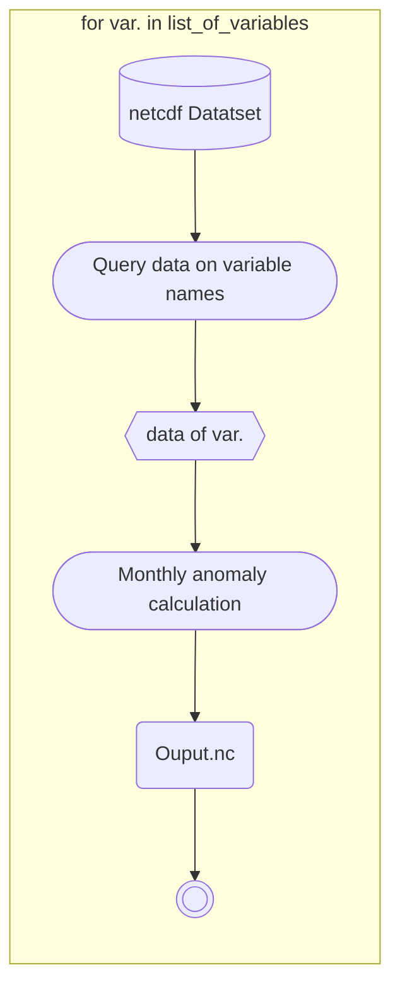

# Workflow for calculating monthly anomaly data 

## The math:

The method for calculating anomaly used in the method described below,

$$
x_{i, j}' = x_{i,j} - \bar{x}_i
$$

where $i$ is a month, and $j$ is the year. $\bar{x}_i$ is the historic mean of that month.

## Method

### Goal
We want to calculate monthly anomaly data for a list of variables stored together in a netCDF file, and later store them separately in the same `.nc` format.

### Setup

Go ahead and open a new python script or Jupyter Notebook, and start code setup,
```python title="main.py"
import xarray as xr
import os

# location directory
nc_path = "~\...\LIS_HIST_2001_to_2023_Monthly.nc" 

# list of variables we are interested in
list_of_variables = ['Rainf_tavg','SoilMoist_inst','Qs_tavg', 
'Evap_tavg','SoilTemp_inst','Qair_f_tavg']

```

### Preparing data for processing
Load the dataset into our RAM using `xr.open_dataset()`, 
```python
dataset = xr.open_dataset(nc_path)
```
But this pass the entire netCDF file into our environment, in order to call a single variable from the dataset use the following code,
```
data = dataset[variable]
```

:::tip
Double check with `print()`, the output should only include one variable.
```python
# for example
data_rainfall = dataset["Rainf_tavg"]

print(data_rainfall)
```

```terminal title="Python 3"
<xarray.DataArray 'Rainf_tavg' (time: 276, lat: 540, lon: 660)>
[98366400 values with dtype=float32]
Coordinates:
  * time     (time) datetime64[ns] 2001-01-31 2001-02-28 ... 2023-12-31
  * lat      (lat) float64 -20.98 -20.93 -20.88 -20.82 ... 5.875 5.925 5.975
  * lon      (lon) float64 -81.97 -81.92 -81.88 -81.83 ... -49.13 -49.08 -49.03
Attributes:
    units:          mm/day
    standard_name:  precipitation_rate
    long_name:      precipitation rate
    vmin:           0.0
    vmax:           0.0

```
:::


### Calculation w/ xarrary package


```python title="main.py"
# Calculate the monthly average
mean_data = data.sel(time=slice('2001','2020')).groupby("time.month").mean(dim='time')

# Calculate the anomaly
anomaly = data.groupby("time.month") - mean_data
```

`data.mean(dim="time")` tells Xarray that we want the mean to be calculated along the **time** dimension. 

`data.sel(time=slice('2001','2020'))` defines our mean value calculation is based on the data given from the year 2001 to 2020.

`data.groupby("time.month")` tells Xarray that we are interested in the monthly average, expressed as $\bar{x}_i$.

:::info
For full description look under Xarray's official documentation page
:::

### Formatting for storage

```python title="main.py"
# Create a new dataset with the anomaly
anomaly_ds = anomaly.to_dataset(name=f'{variable}_anomaly')

# Config the new netCDF file name
output_file_path = os.path.join(output_file_path, f"{variable}_anomlay.nc")

# Save to a new netCDF file
anomaly_ds.to_netcdf(output_file_path)
```


## Iterating through a list of variable

Add a `for loop` at the beginning of the snippet provided here.




:::tip
Make changes to arguments passed to your kernel accordingly when making these changes
:::
