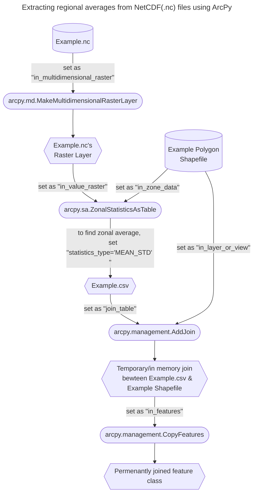

# Raster to polygon conversion

This documentation page go through the raster to polygon conversion we used when we put together

```mermaid
---
title: Extracting regional averages from NetCDF(.nc) files using ArcPy 
---
flowchart TD
    A[(Example.nc)] -->|set as ''in_multidimensional_raster''| B([arcpy.md.MakeMultidimensionalRasterLayer])--> C{{Example.nc's 
    Raster Layer}}
    D[(Example Polygon
    Shapefile)] --> |set as ''in_zone_data''| E([arcpy.sa.ZonalStatisticsAsTable])
    
    C -->|set as ''in_value_raster''| E
     
    E -->|to find zonal average, 
    set ''statistics_type='MEAN_STD' ''| F{{Example.csv}}

    F -->|set as ''join_table''| G([arcpy.management.AddJoin])

    D -->|set as ''in_layer_or_view''| G

    G --> H{{Temporary/in memory join
    bewteen Example.csv & Example Shapefile}}

    H -->|set as ''in_features''| I([arcpy.management.CopyFeatures])

    I --> J{{Permenantly joined feature class}}
```

